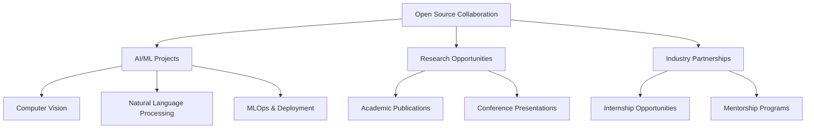
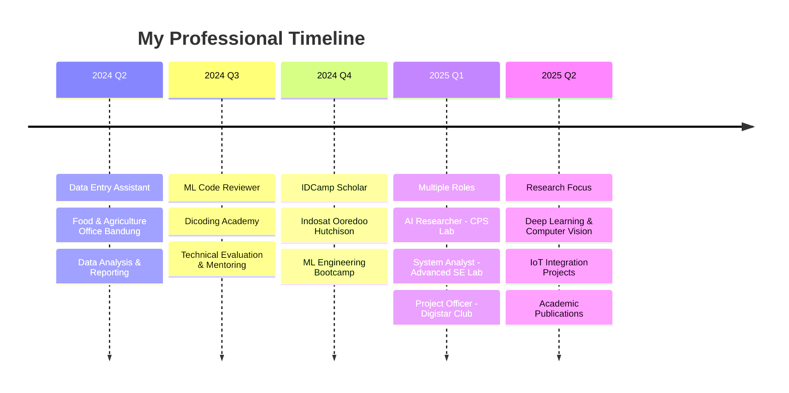

<div align="center">
  
##### Hey there! 👋 I'm 
## **Syahril Arfian Almazril**

<br>


<br>

<div align="center">


<div>
  
---

<div align="left">

```python

class Aboutme:
    def __init__(self):
        self.name = "Syahril Arfian Almazril"
        self.current_role = "AI & Automation Engineer"
        self.education = "Information Technology - Telkom University"
        self.location = "Jakarta, Indonesia 🇮🇩"
        
        self.passion = [
            "🧠 Deep Learning & Neural Networks",
            "👁️ Computer Vision & Image Processing", 
            "🤖 Natural Language Processing",
            "⚡ MLOps & Production Deployment",
            "🔌 IoT Integration & Automation"
        ]
    
    def current_focus(self):
        return {
            "research": ["Deep Learning", "Computer Vision", "Machine Learning", "NLP", "LLM"],
            "tools": ["Python", "TensorFlow", "PyTorch", "OpenCV"],
            "learning": "Advanced transformer architectures & model optimization",
            "building": "End-to-end AI pipelines with scalable deployment",
            "collaborating": "Open-source AI projects & research publications"
        }
    
    def specialties(self):
        return ["Machine Learning", "Computer Vision", "NLP", "MLOps", "IoT Systems"]

researcher = Aboutme()
print(researcher.specialties())
```

```
['Machine Learning', 'Computer Vision', 'NLP', 'MLOps', 'IoT Systems']
```

  
## What I'm Looking For

<div align="center">



</div>


<div align="right">

## Tech Stack

<p align="right">
  <a href="https://www.python.org" target="_blank" rel="noreferrer"></a>
  <a href="https://www.typescriptlang.org/" target="_blank" rel="noreferrer"></a>
  <a href="https://golang.org" target="_blank" rel="noreferrer"></a>
  <a href="https://isocpp.org/" target="_blank" rel="noreferrer"></a>
  <a href="https://www.r-project.org/" target="_blank" rel="noreferrer"></a>
  <a href="https://www.javascript.com/" target="_blank" rel="noreferrer"></a>
  <a href="https://www.tensorflow.org" target="_blank" rel="noreferrer"></a>
  <a href="https://pytorch.org/" target="_blank" rel="noreferrer"></a>
  <a href="https://keras.io/" target="_blank" rel="noreferrer"></a>
  <a href="https://scikit-learn.org/" target="_blank" rel="noreferrer"></a>
  <a href="https://huggingface.co/" target="_blank" rel="noreferrer"></a>
  <a href="https://langchain.com/" target="_blank" rel="noreferrer"></a>
  <a href="https://xgboost.ai/" target="_blank" rel="noreferrer"></a>
  <a href="https://pandas.pydata.org/" target="_blank" rel="noreferrer"></a>
  <a href="https://numpy.org/" target="_blank" rel="noreferrer"></a>
  <a href="https://opencv.org/" target="_blank" rel="noreferrer"></a>
  <a href="https://matplotlib.org/" target="_blank" rel="noreferrer"></a>
  <a href="https://plotly.com/" target="_blank" rel="noreferrer"></a>
  <a href="https://grafana.com/" target="_blank" rel="noreferrer"></a>
  <a href="https://fastapi.tiangolo.com/" target="_blank" rel="noreferrer"></a>
  <a href="https://flask.palletsprojects.com/" target="_blank" rel="noreferrer"></a>
  <a href="https://streamlit.io/" target="_blank" rel="noreferrer"></a>
  <a href="https://graphql.org/" target="_blank" rel="noreferrer"></a>
  <a href="https://git-scm.com/" target="_blank" rel="noreferrer"></a>
  <a href="https://github.com/features/actions" target="_blank" rel="noreferrer"></a>
  <a href="https://aws.amazon.com/" target="_blank" rel="noreferrer"></a>
  <a href="https://cloud.google.com/" target="_blank" rel="noreferrer"></a>
  <a href="https://docker.com/" target="_blank" rel="noreferrer"></a>
  <a href="https://kubernetes.io/" target="_blank" rel="noreferrer"></a>
  <a href="https://www.terraform.io/" target="_blank" rel="noreferrer"></a>
  <a href="https://www.postgresql.org" target="_blank" rel="noreferrer"></a>
  <a href="https://www.mongodb.com/" target="_blank" rel="noreferrer"></a>
  <a href="https://firebase.google.com/" target="_blank" rel="noreferrer"></a>
  <a href="https://jupyter.org/" target="_blank" rel="noreferrer"></a>
</p>
</div>


## **Professional Journey**

<div align="center">



</div>


<div align="center">

### **I'm actively seeking collaborations in:**

<table>
<tr>
<td align="center" width="25%">


**🧠 AI Research**
Open-source ML projects
Academic publications
Novel algorithm development
</td>
<td align="center" width="25%">


**🔌 IoT Integration**
Smart system development
Real-time monitoring
Edge AI deployment
</td>
<td align="center" width="25%">


**🤝 Open Source**
Community contributions
Code reviews & mentoring
Tech talks & workshops
</td>
<td align="center" width="25%">


**🚀 Startups**
MVP development
Technical consulting
Innovation projects
</td>
</tr>
</table>

---

<picture>
  <source media="(prefers-color-scheme: dark)" srcset="https://github-readme-activity-graph.vercel.app/graph?username=Arfazrll&theme=tokyo-night&hide_border=true&bg_color=0D1117&color=00D9FF&line=00D9FF&point=FF6B35"/>
  
</picture>

<picture>
  <source media="(prefers-color-scheme: dark)" srcset="https://github-readme-streak-stats.herokuapp.com/?user=Arfazrll&theme=tokyonight&hide_border=true&background=0D1117&stroke=00D9FF&ring=00D9FF&fire=FF6B35&currStreakLabel=00D9FF&cache_bust=1"/>
  
</picture><picture>
  <source media="(prefers-color-scheme: dark)" srcset="https://github-readme-stats.vercel.app/api/top-langs/?username=Arfazrll&layout=compact&theme=tokyonight&hide_border=true&bg_color=0D1117&title_color=00D9FF&text_color=FFFFFF&langs_count=10&cache_bust=1"/>
  
</picture>
<br>

---

### 💭 **Connect & Collaborate**

> *"In the intersection of artificial intelligence and human creativity lies the power to solve tomorrow's challenges today. Every line of code is a step toward a more intelligent, automated, and accessible future."*

**🎯 Current Mission:** Building AI systems that bridge the gap between cutting-edge research and real-world impact.


<br>

[](https://linkedin.com/in/syahril-arfian-almazril-215a12231)
[](mailto:azril4974@gmail.com)
[](https://personal-iqyuflz4z-arfazrlls-projects.vercel.app/)
[](https://instagram.com/arfazrl09_)


