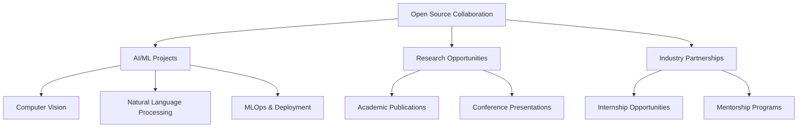
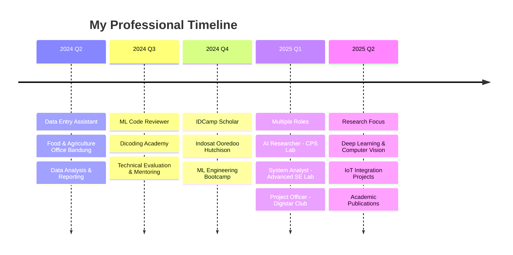

<div align="center">

##### Hey there! 👋 I'm 
<h1 align="center">Syahril Arfian Almazril</h1>
<p align="center">

<br>


<div align="center">
  


<br>

<div align="center">
  
</div>
<br>

<div align="center">

          

<div>
<br>
  


<div align="left">

```python

class Aboutme:
    def __init__(self):
        self.name = "Syahril Arfian Almazril"
        self.current_role = "AI & Automation Engineer"
        self.education = "Information Technology - Telkom University"
        self.location = "Jakarta, Indonesia 🇮🇩"
        
        self.passion = [
            "🧠 Deep Learning & Neural Networks"
            "👁️ Computer Vision & Image Processing" 
            "🤖 Natural Language Processing"
            "⚡ MLOps & Production Deployment"
            "🔌 IoT Integration & Automation"
        ]
    
    def current_focus(self):
        return {
            "research": ["Deep Learning", "Computer Vision", "Machine Learning", "NLP", "LLM", "Reinforcement Learning"]
            "tools": ["Python", "TensorFlow", "PyTorch", "OpenCV", "Scikit-learn", "Hugging Face", "Keras", "FastAPI"]
            "learning": "Advanced transformer architectures, multimodal AI, and model optimization for deployment"
            "building": "End-to-end AI pipelines for real-world applications, from data ingestion to scalable deployment"
            "collaborating": "Open-source AI projects, publishing research, and contributing to technical communities"
        }
    
    def specialties(self):
        return ["Machine Learning", "Deep Learning","Computer Vision", "NLP", "LLM"]

researcher = Aboutme()
print(researcher.specialties())
```

```
An AI & Automation Engineer building impactful, end-to-end AI systems from data to deployment. My expertise covers Machine Learning, Computer Vision, NLP, and MLOps, using a core stack of Python, TensorFlow, PyTorch, and Docker. I thrive on solving complex challenges and am open to collaboration.
```


<div align="center">

  

<div>

<div align="center">

<div align="center">



</div>

<div align="center">
  
---

<div align="center">



</div>


---

<picture>
  <source media="(prefers-color-scheme: dark)" srcset="https://github-readme-activity-graph.vercel.app/graph?username=Arfazrll&theme=tokyo-night&hide_border=true&bg_color=0D1117&color=00D9FF&line=00D9FF&point=FF6B35"/>
  
</picture>

<picture>
  <source media="(prefers-color-scheme: dark)" srcset="https://github-readme-streak-stats.herokuapp.com/?user=Arfazrll&theme=tokyonight&hide_border=true&background=0D1117&stroke=00D9FF&ring=00D9FF&fire=FF6B35&currStreakLabel=00D9FF&cache_bust=1"/>
  
</picture><picture>
  <source media="(prefers-color-scheme: dark)" srcset="https://github-readme-stats.vercel.app/api/top-langs/?username=Arfazrll&layout=compact&theme=tokyonight&hide_border=true&bg_color=0D1117&title_color=00D9FF&text_color=FFFFFF&langs_count=10&cache_bust=1"/>
  
</picture>
<br>

<div align="center">

### I'm actively seeking collaborations in:

<table width="100%">
<tr>
<td align="center" width="25%">
  <picture>
    <source media="(prefers-color-scheme: dark)" srcset="https://api.iconify.design/mdi/brain.svg?color=white">
    <source media="(prefers-color-scheme: light)" srcset="https://api.iconify.design/mdi/brain.svg?color=black">
    
  </picture>
  <br>
  <strong>AI Research & Development</strong>
  <br><br>
  <small>
    Computer Vision Projects<br>
    NLP & LLM Applications<br>
    Publishing Research
  </small>
</td>
<td align="center" width="25%">
  <picture>
    <source media="(prefers-color-scheme: dark)" srcset="https://api.iconify.design/mdi/lan.svg?color=white">
    <source media="(prefers-color-scheme: light)" srcset="https://api.iconify.design/mdi/lan.svg?color=black">
    
  </picture>
  <br>
  <strong>AI & IoT Integration</strong>
  <br><br>
  <small>
    AI-Powered Automation<br>
    Smart System Integration<br>
    Real-Time Data Processing
  </small>
</td>
<td align="center" width="25%">
  <picture>
    <source media="(prefers-color-scheme: dark)" srcset="https://api.iconify.design/mdi/open-source-initiative.svg?color=white">
    <source media="(prefers-color-scheme: light)" srcset="https://api.iconify.design/mdi/open-source-initiative.svg?color=black">
    
  </picture>
  <br>
  <strong>Open Source</strong>
  <br><br>
  <small>
    Community Contributions<br>
    Mentoring & Code Review<br>
    Developing Useful Tools
  </small>
</td>
<td align="center" width="25%">
  <picture>
    <source media="(prefers-color-scheme: dark)" srcset="https://api.iconify.design/mdi/rocket-launch.svg?color=white">
    <source media="(prefers-color-scheme: light)" srcset="https://api.iconify.design/mdi/rocket-launch.svg?color=black">
    
  </picture>
  <br>
  <strong>Startups & Innovation</strong>
  <br><br>
  <small>
    Building & Scaling MVPs<br>
    AI-as-a-Service Consulting<br>
    Prototyping New Ideas
  </small>
</td>
</tr>
</table>


### 💭 **Connect & Collaborate**

> *"My work lives at the intersection of data, algorithms, and the physical world. I engineer intelligent systems—from the cloud to the edge—that perceive, reason, and interact with their environment."*

**🎯 My Mission:** To deploy autonomous AI that operates safely, efficiently, and delivers tangible value in the most demanding environments.

<br>

[](https://linkedin.com/in/syahril-arfian-almazril-215a12231)
[](mailto:azril4974@gmail.com)
[](https://personal-iqyuflz4z-arfazrlls-projects.vercel.app/)
[](https://instagram.com/arfazrl09_)

<br>


