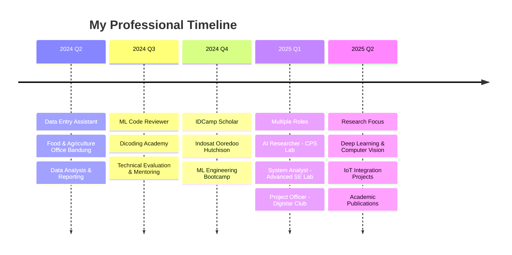

<div align="center">
  
# 🚀 Syahril Arfian Almazril


<div align="center">
  
</div>

[](https://visitcount.itsvg.in)
[](https://linkedin.com/in/syahril-arfian-almazril-215a12231)
[](mailto:azril4974@gmail.com)

</div>

---

## 🎯 **About Me**

```python
#!/usr/bin/env python3
"""
AI Research Engineer Profile
Building intelligent systems that matter
"""

class AIResearcher:
    def __init__(self):
        self.name = "Syahril Arfian Almazril"
        self.current_role = "AI Research Intern @ Cyber Physical System Lab"
        self.education = "Information Technology - Telkom University"
        self.location = "Jakarta, Indonesia 🇮🇩"
        
        self.passion = [
            "🧠 Deep Learning & Neural Networks",
            "👁️ Computer Vision & Image Processing", 
            "🤖 Natural Language Processing",
            "⚡ MLOps & Production Deployment",
            "🔌 IoT Integration & Automation"
        ]
    
    def current_focus(self):
        return {
            "research": "AI-driven IoT systems for real-time monitoring",
            "learning": "Advanced transformer architectures & model optimization",
            "building": "End-to-end ML pipelines with scalable deployment",
            "collaborating": "Open-source AI projects & research publications"
        }
    
    def life_motto(self):
        return "Code with purpose, innovate with impact 🚀"

# Initialize the journey
researcher = AIResearcher()
print(researcher.life_motto())
```

---

<div align="center">

## 🏆 **Achievements & Recognition**

<table>
<tr>
<td align="center" width="33%">


**🥉 Top 6/32**
<br>
*Business Case Prototype*
<br>
**GENBI UNSHIKA 2025**
<br>
`Innovation Excellence`

</td>
<td align="center" width="33%">


**🏅 Top 15/90**
<br>
*Data Mining Competition*
<br>
**Telkom University 2024**
<br>
`Technical Mastery`

</td>
<td align="center" width="33%">


**🎓 Scholar**
<br>
*AI Engineering Program*
<br>
**DBS Foundation 2025**
<br>
`Future Leader`

</td>
</tr>
</table>

</div>

---

## 💼 **Professional Journey**

<div align="center">



</div>

### 🔬 **Current Positions**

<table>
<tr>
<td width="50%">

#### 🧠 **AI Research Intern**
**Cyber Physical System Laboratory**
- 🔍 Developing intelligent IoT monitoring systems
- 🤖 Implementing state-of-the-art ML algorithms  
- 📊 Real-time data processing & visualization
- 📝 Contributing to academic research papers

</td>
<td width="50%">

#### 🛠️ **System Analyst**
**Advanced Software Engineering Lab**
- 📋 Requirements analysis & SRS documentation
- 🏗️ System architecture design with UML
- 🤝 Cross-functional team collaboration
- 🎯 Technical liaison & problem solving

</td>
</tr>
</table>

---

<div align="center">

## 🛠️ **Technology Ecosystem**

### **Core AI/ML Stack**


### **Data Science & Analytics**


### **Development & Deployment**


### **Cloud & Infrastructure**


### **Additional Languages**


</div>

---

## 🚀 **Featured Projects**

<div align="center">

<table>
<tr>
<td align="center" width="33%">

### 🎯 **Real-Time Object Detection**


Advanced YOLO implementation for live video processing with optimized inference speed and accuracy metrics.

**Key Features:**
- ⚡ Real-time processing
- 🎯 Multi-object detection  
- 📊 Performance analytics
- 🔧 Custom model fine-tuning

</td>
<td align="center" width="33%">

### 🖼️ **CNN Image Classifier**


Deep convolutional neural network architecture for multi-class image classification with transfer learning optimization.

**Key Features:**
- 🧠 Custom CNN architecture
- 🔄 Transfer learning
- 📈 Advanced preprocessing
- 🎨 Data augmentation

</td>
<td align="center" width="33%">

### 📊 **ML Algorithm Comparison**


Comprehensive analysis and comparison of SVM, KNN, and Naive Bayes algorithms with performance benchmarking.

**Key Features:**
- 🔍 Algorithm comparison
- 📊 Performance metrics
- 🎯 Hyperparameter tuning
- 📈 Visualization suite

</td>
</tr>
</table>

</div>

---

<div align="center">

## 📊 **GitHub Analytics**

<picture>
  <source media="(prefers-color-scheme: dark)" srcset="https://github-readme-stats.vercel.app/api?username=Arfazrll&show_icons=true&theme=tokyonight&hide_border=true&bg_color=0D1117&title_color=00D9FF&icon_color=00D9FF&text_color=FFFFFF&count_private=true&include_all_commits=true"/>
  
</picture>

<picture>
  <source media="(prefers-color-scheme: dark)" srcset="https://github-readme-streak-stats.herokuapp.com/?user=Arfazrll&theme=tokyonight&hide_border=true&background=0D1117&stroke=00D9FF&ring=00D9FF&fire=FF6B35&currStreakLabel=00D9FF"/>
  
</picture>

<picture>
  <source media="(prefers-color-scheme: dark)" srcset="https://github-readme-stats.vercel.app/api/top-langs/?username=Arfazrll&layout=compact&theme=tokyonight&hide_border=true&bg_color=0D1117&title_color=00D9FF&text_color=FFFFFF&langs_count=10"/>
  
</picture>

### **Contribution Activity**
<picture>
  <source media="(prefers-color-scheme: dark)" srcset="https://github-readme-activity-graph.vercel.app/graph?username=Arfazrll&theme=tokyo-night&hide_border=true&bg_color=0D1117&color=00D9FF&line=00D9FF&point=FF6B35"/>
  
</picture>

</div>

---

## 🏅 **Certifications & Credentials**

<div align="center">

<table>
<tr>
<th align="center">🌟 Recent Certifications</th>
<th align="center">🎯 Specialization</th>
<th align="center">📅 Year</th>
<th align="center">🏢 Provider</th>
</tr>
<tr>
<td align="center">Data Analyst on Google Cloud</td>
<td align="center">Cloud Analytics & ML</td>
<td align="center">2025</td>
<td align="center">Google Cloud</td>
</tr>
<tr>
<td align="center">Supervised ML: Regression & Classification</td>
<td align="center">Machine Learning</td>
<td align="center">2025</td>
<td align="center">DeepLearning.AI</td>
</tr>
<tr>
<td align="center">Machine Learning Foundation</td>
<td align="center">AWS ML Services</td>
<td align="center">2024</td>
<td align="center">Amazon Web Services</td>
</tr>
<tr>
<td align="center">Machine Learning Modeling</td>
<td align="center">ML Pipeline Development</td>
<td align="center">2024</td>
<td align="center">Dicoding Indonesia</td>
</tr>
</table>

**🎓 Additional Learning:**
`AWS Academy Graduate` • `Python Advanced` • `SQL Fundamentals` • `React Fundamentals`

</div>

---

<div align="center">

## 🤝 **Let's Build the Future Together**

### **I'm actively seeking collaborations in:**

<table>
<tr>
<td align="center" width="25%">


**🧠 AI Research**
Open-source ML projects
Academic publications
Novel algorithm development
</td>
<td align="center" width="25%">


**🔌 IoT Integration**
Smart system development
Real-time monitoring
Edge AI deployment
</td>
<td align="center" width="25%">


**🤝 Open Source**
Community contributions
Code reviews & mentoring
Tech talks & workshops
</td>
<td align="center" width="25%">


**🚀 Startups**
MVP development
Technical consulting
Innovation projects
</td>
</tr>
</table>

---

### **Connect & Collaborate**

[](https://linkedin.com/in/syahril-arfian-almazril-215a12231)
[](mailto:azril4974@gmail.com)
[](https://personal-iqyuflz4z-arfazrlls-projects.vercel.app/)
[](https://instagram.com/arfazrl09_)

---

### **💭 Personal Philosophy**

> *"In the intersection of artificial intelligence and human creativity lies the power to solve tomorrow's challenges today. Every line of code is a step toward a more intelligent, automated, and accessible future."*

**🎯 Current Mission:** Building AI systems that bridge the gap between cutting-edge research and real-world impact.

---

<picture>
  <source media="(prefers-color-scheme: dark)" srcset="https://github.com/Arfazrll/Arfazrll/blob/main/github-contribution-grid-snake-dark.svg" />
  <source media="(prefers-color-scheme: light)" srcset="https://github.com/Arfazrll/Arfazrll/blob/main/github-contribution-grid-snake.svg" />
  
</picture>

---


</div>
