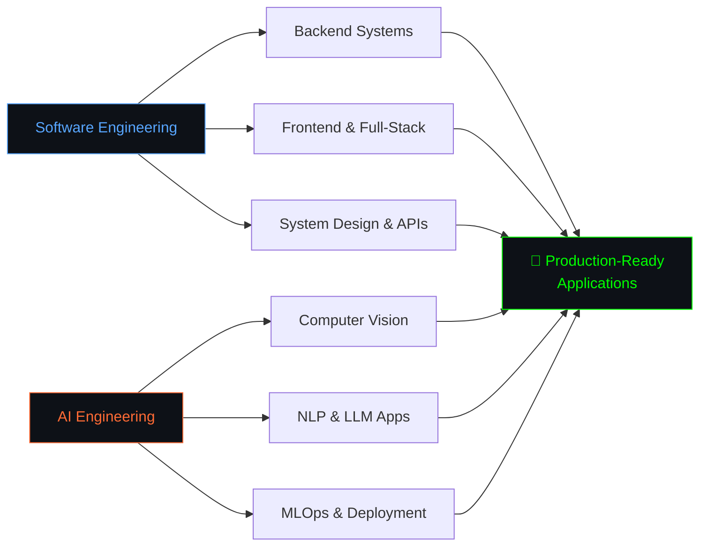
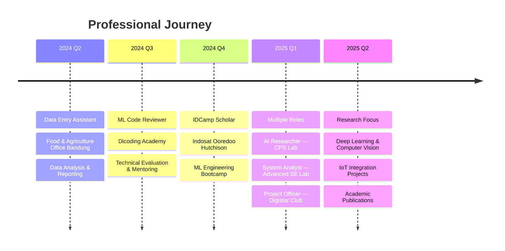

<div align="center">

##### Hey there! 👋 I'm

<h1 align="center">Syahril Arfian Almazril</h1>

<br>


</div>

<div align="left">

```python
class SyahrilArfian:
    def __init__(self):
        self.name = "Syahril Arfian Almazril"
        self.role = ["Software Engineer", "AI Engineer"]
        self.education = "B.Sc. Information Technology — Telkom University"
        self.location = "Jakarta, Indonesia 🇮🇩"

    def software_engineering(self):
        return {
            "languages": ["Python", "TypeScript", "Go", "Java", "PHP"],
            "backend": ["Node.js", "Express", "FastAPI", "Spring Boot", "Laravel", "Django"],
            "frontend": ["Next.js", "React", "Tailwind CSS"],
            "databases": ["PostgreSQL", "MongoDB", "MySQL", "Redis"],
            "devops": ["Docker", "CI/CD", "Git", "Linux"],
            "architecture": ["REST APIs", "Microservices", "Event-Driven", "Clean Architecture"],
        }

    def ai_engineering(self):
        return {
            "domains": ["Computer Vision", "NLP", "LLM", "Reinforcement Learning"],
            "frameworks": ["TensorFlow", "PyTorch", "Scikit-learn", "Hugging Face", "Keras"],
            "tools": ["OpenCV", "LangChain", "MLflow", "FastAPI"],
            "focus": [
                "Transformer architectures & multimodal AI",
                "End-to-end ML pipelines — data ingestion to deployment",
                "Model optimization & production-grade inference",
                "IoT × AI integration for edge intelligence",
            ],
        }

    def philosophy(self):
        return "Ship robust software. Deploy intelligent systems. Solve real problems."

me = SyahrilArfian()
print(me.role)  # ['Software Engineer', 'AI Engineer']
```

```
A Software Engineer and AI Engineer who designs, builds, and ships end-to-end systems —
from scalable backend architectures to production ML pipelines. I work across the full
stack: crafting clean APIs, deploying deep learning models, and wiring intelligence into
real-world applications. Core expertise spans Full-Stack Development, Machine Learning,
Computer Vision, NLP, and MLOps.
```

</div>

<div align="center">


## ⚙️ Tech Stack


<br>


<br><br>

           


## 🏗️ What I Build

</div>



<div align="center">


## 📈 Experience Timeline

</div>



<div align="center">


## 🔭 Open to Collaboration

<table width="100%">
<tr>
<td align="center" width="25%">
  <picture>
    <source media="(prefers-color-scheme: dark)" srcset="https://api.iconify.design/mdi/code-braces-box.svg?color=white">
    <source media="(prefers-color-scheme: light)" srcset="https://api.iconify.design/mdi/code-braces-box.svg?color=black">
    
  </picture>
  <br>
  <strong>Software Development</strong>
  <br><br>
  <small>
    Full-Stack Applications<br>
    API Design & Microservices<br>
    Open Source Contributions
  </small>
</td>
<td align="center" width="25%">
  <picture>
    <source media="(prefers-color-scheme: dark)" srcset="https://api.iconify.design/mdi/brain.svg?color=white">
    <source media="(prefers-color-scheme: light)" srcset="https://api.iconify.design/mdi/brain.svg?color=black">
    
  </picture>
  <br>
  <strong>AI Research & Development</strong>
  <br><br>
  <small>
    Computer Vision & NLP<br>
    LLM Applications<br>
    Publishing Research
  </small>
</td>
<td align="center" width="25%">
  <picture>
    <source media="(prefers-color-scheme: dark)" srcset="https://api.iconify.design/mdi/lan.svg?color=white">
    <source media="(prefers-color-scheme: light)" srcset="https://api.iconify.design/mdi/lan.svg?color=black">
    
  </picture>
  <br>
  <strong>AI × IoT Integration</strong>
  <br><br>
  <small>
    Edge Intelligence<br>
    Smart Automation<br>
    Real-Time Processing
  </small>
</td>
<td align="center" width="25%">
  <picture>
    <source media="(prefers-color-scheme: dark)" srcset="https://api.iconify.design/mdi/rocket-launch.svg?color=white">
    <source media="(prefers-color-scheme: light)" srcset="https://api.iconify.design/mdi/rocket-launch.svg?color=black">
    
  </picture>
  <br>
  <strong>Startups & Innovation</strong>
  <br><br>
  <small>
    Building & Scaling MVPs<br>
    AI-as-a-Service<br>
    Prototyping Ideas
  </small>
</td>
</tr>
</table>


## 📊 GitHub Stats

<picture>
  <source media="(prefers-color-scheme: dark)" srcset="https://github-readme-activity-graph.vercel.app/graph?username=Arfazrll&theme=tokyo-night&hide_border=true&bg_color=0D1117&color=00D9FF&line=00D9FF&point=FF6B35"/>
  
</picture>

<picture>
  <source media="(prefers-color-scheme: dark)" srcset="https://github-readme-streak-stats.herokuapp.com/?user=Arfazrll&theme=tokyonight&hide_border=true&background=0D1117&stroke=00D9FF&ring=00D9FF&fire=FF6B35&currStreakLabel=00D9FF&cache_bust=1"/>
  
</picture><picture>
  <source media="(prefers-color-scheme: dark)" srcset="https://github-readme-stats.vercel.app/api/top-langs/?username=Arfazrll&layout=compact&theme=tokyonight&hide_border=true&bg_color=0D1117&title_color=00D9FF&text_color=FFFFFF&langs_count=10&cache_bust=1"/>
  
</picture>


### 💭 Connect & Collaborate

> *"I engineer systems that think — from robust backend architectures to intelligent models that perceive, reason, and act. My work bridges software craftsmanship with AI innovation."*

**🎯 Mission:** Build software that scales and intelligence that ships.

<br>

[](https://linkedin.com/in/syahril-arfian-almazril-215a12231)
[](mailto:azril4974@gmail.com)
[](https://personal-iqyuflz4z-arfazrlls-projects.vercel.app/)
[](https://instagram.com/arfazrl09_)

<br>


</div>
